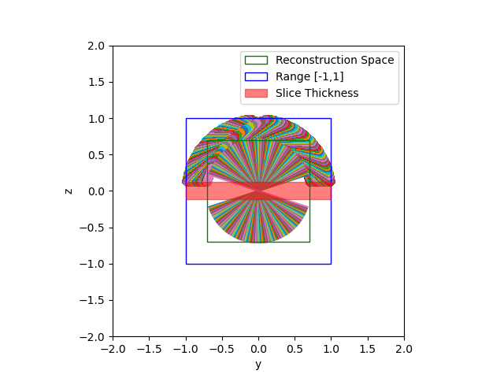

# ***"Clean Implicit 3D Structure from Noisy 2D STEM Images", CVPR 2022***  

This directory contains all code regarding the reconstruction, as proposed in the paper. Further all base lines are provided.

---
## Generate Training Data from Images

    DataFromImages.py

Generates Training Data from a set of images and a .rawtlt file. 
The .rawtlt file must contain all projection angles in degree in sequential order.

It further saves a figure showing the projection micrographs and reconstruction space for monitoring purposes.  

|Args Parameter   | Explanation | Default |  
|---|---|---|
| --micrograph_path  | Directory of the folder containing micrographs (.tif) and rawtlt file | ./Micrographs/ |
| --save_to  | Directory to save training data to | ./TrainingData/ |
| --slice  | Normalized slice thickness of the sample to reconstruct. This can be approximated by using WBP. If unknown (or for synthetic data) set to 1. It is crucial that the set slice thickness is $\ge$ the true slice thickness. | 1 |
| --norm_coords | Normalizes positional coordinates to a range $\in [-1,1]$  | False |
| --synthetic | Set when working with the provided synthetic data.  | False |

### Example Use Synthetic Data

    python DataFromImages.py --micrograph_path ./_Data/Synthetic/Micrographs/Clean/ --save_to ./_Data/Synthetic/TrainingData/Clean/

### Example Use Real Data

    python DataFromImages.py  --micrograph_path ./_Data/Real_CovidInfectedCell/Micrographs/Noisy/ --save_to _Data/Real_CovidInfectedCell/TrainingData/Noisy/ --slice 0.34 --norm_coords 

If you'd like to define your validation files, please provide a directory "val_files" inside the training data directory. Otherwise, validation will be picked randomly from the training files.

---

## Training Implicit Model

    Trainer_Implicit.py

Training of Implicit Models for Tomographic Reconstruction. This script contains training procedures of **L2Noisy**, **L2Den**, **OursSup** and **Ours**.

Before training you'll need to setup wandb details for monitoring the training. Please set

    os.environ['WANDB_API_KEY'] = ""
    os.environ['WANDB_ENTITY']= ""

according to your [weights and bias](https://wandb.ai/site) account details. You'll find the system variable setting in *Trainer_Implicit.py* line 24 following.

Most important args parameters for training. For more details please see 

    Trainer_Implicit.py --help

|Args Parameter   | Explanation | Default |  
|---|---|---|
|--iterations| Training iterations | 400,000 |
|--val_step | Interval for validation | 10,000 |
|--log_path | Path to log training and model details to | ./TrainingRuns/ |
|--data_path | Path to .pkl files of the training data | ./TrainingData/ |
|--loss | Define which loss to use. Choose one of (mle, l2) | l2 |
|--nf_optim | Optimizer for noise model. Choose one of (sgd, adam) | sgd |
|--nf_lr | Learning rate of the noise model | 5e-5 |
|--optim | Optimizer for implicit reconstruction. Choose one of (sgd, adam) | adam |
|--lr | Learning rate if the implict reconstruction. | 5e-5 | 
|--project | Specify wandb project name | EM_Tomogram |
|--run_name | Specify wandb run name | |
| --gt_vol | Path to GT phantom volume for validation (synthetic data only) | ./Tomograms/ |

### Training Ours

    python Trainer_Implicit.py --data_path /_Data/Synthetic/TrainingData/Noisy_Implicit/ --gt_vol ./_Data/Synthetic/PhantomVolume/ --log_path ./TrainingRuns/Synthetic/Ours/ --loss mle --optim adam --lr 5e-5 --nf_optim sgd --nf_lr 5e-5 --project Implicit-Electron-Tomography --run_name Ours

### Training OursSup

    python Trainer_Implicit.py --data_path /_Data/Synthetic/TrainingData/Noisy_Implicit/ --log_path ./TrainingRuns/Synthetic/OursSup/ --gt_vol ./_Data/Synthetic/PhantomVolume/--loss mle --optim adam --lr 5e-5 --nf_path ./PretrainedModels/NoiseModelSupervised/training_state.pth --project Implicit-Electron-Tomography --run_name OursSup

### Training L2Noisy, L2Clean, L2Den and L2Blur

    python Trainer_Implicit.py --data_path /_Data/Synthetic/TrainingData/Noisy_Implicit/ --gt_vol ./_Data/Synthetic/PhantomVolume/ --log_path ./TrainingRuns/Synthetic/L2Noisy/ --loss l2 --optim adam --lr 5e-5 --project Implicit-Electron-Tomography --run_name L2Noisy

    python Trainer_Implicit.py --data_path /_Data/Synthetic/TrainingData/Clean_Implicit/ --gt_vol ./_Data/Synthetic/PhantomVolume/ --log_path ./TrainingRuns/Synthetic/L2Clean/ --loss l2 --optim adam --lr 5e-5 --project Implicit-Electron-Tomography --run_name L2Clean

    python Trainer_Implicit.py --data_path ./_Data/Synthetic/TrainingData/Denoised_BM3D_Implicit/ --gt_vol ./_Data/Synthetic/PhantomVolume/ --log_path ./TrainingRuns/Synthetic/L2Den/ --loss l2 --optim adam --lr 5e-5 --project Implicit-Electron-Tomography --run_name L2Den

    python Trainer_Implicit.py --data_path ./_Data/Synthetic/TrainingData/Clean_Defocus50_Implicit/ --gt_vol ./_Data/Synthetic/PhantomVolume/ --log_path ./TrainingRuns/Synthetic/L2Blur/ --loss l2 --optim adam --lr 5e-5 --project Implicit-Electron-Tomography --run_name L2Blur

### Training L2Blur+

    python Trainer_Implicit.py --data_path ./_Data/Synthetic/TrainingData/Clean_Defocus50_Implicit/ --gt_vol ./_Data/Synthetic/PhantomVolume/ --log_path ./TrainingRuns/Synthetic/L2Blur+/ --defocus --max_defocus 50 --loss l2 --optim adam --lr 5e-5 --project Implicit-Electron-Tomography --run_name L2Blur+

---

## Training Explicit Model

    Trainer_Explicit.py

Training of Explicit Models for Tomographic Reconstruction. This script contains training procedures of **Explicit L2Noisy**, **Explicit L2Noisy + TV**, **Explicit Ours** and **Explicit Ours + TV**.

Before training you'll need to setup wandb details for monitoring the training. Please set

    os.environ['WANDB_API_KEY'] = ""
    os.environ['WANDB_ENTITY']= ""

according to your [weights and bias](https://wandb.ai/site) account details. You'll find the system variable setting in *Trainer_Explicit.py* line 26 following.

Most important args parameters for training. For more details please see 

    Trainer_Explicit.py --help

|Args Parameter   | Explanation | Default |  
|---|---|---|
|--iterations| Training iterations | 400,000 |
|--val_step | Interval for validation | 10,000 |
|--log_path | Path to log training and model details to | ./TrainingRuns/ |
|--data_path | Path to .pkl files of the training data | ./TrainingData/ |
|--loss | Define which loss to use. Choose one of (mle, l2) | l2 |
|--nf_optim | Optimizer for noise model. Choose one of (sgd, adam) | sgd |
|--nf_lr | Learning rate of the noise model | 5e-5 |
|--optim | Optimizer for implicit reconstruction. Choose one of (sgd, adam) | adam |
|--lr | Learning rate if the implict reconstruction. | 5e-5 | 
|--project | Specify wandb project name | EM_Tomogram |
|--run_name | Specify wandb run name | |
| --gt_vol | Path to GT phantom volume for validation (synthetic data only) | ./Tomograms/ |
| --grid_res | Resolution of explicit model | 128 |
| --tv | TV regularization for loss computation | 0 |

### Training Explicit L2Noisy
    python -u Trainer_Explicit.py --data_path ./_Data/Synthetic/TrainingData/Noisy_Explicit/ --log_path ./TrainingRuns/Synthetic/L2Noisy_Explicit/ --gt_vol ./_Data/Synthetic/PhantomVolume/ --loss l2 --optim adam --lr 5e-5 --project Implicit-Electron-Tomography --run_name L2Noisy_Explicit --grid_res 512 

### Training Explicit L2Noisy + TV
    python -u Trainer_Explicit.py --data_path ./_Data/Synthetic/TrainingData/Noisy_Explicit/ --log_path ./TrainingRuns/Synthetic/L2Noisy_Explicit/ --gt_vol ./_Data/Synthetic/PhantomVolume/ --loss l2 --optim adam --lr 5e-5 --project Implicit-Electron-Tomography --run_name L2Noisy_Explicit --grid_res 512 --tv 0.05

### Training Explicit Ours 

### Training Explicit Ours + TV

---

## Generation of Tomogram

    GenerateTomogram.py

Generation of a tomogram from a trained implicit model. 

|Args Parameter   | Explanation | Default |  
|---|---|---|
|--resolution | Resolution of the recinstruction | 100 |
|--state_path | Path to model parameters | ./TrainingRuns/training_state.pth/ |
|--save_to | Where to save the reconstruction to | ./Tomograms/ | 
|--name | Name of subfolder to save Tomogram | L2Noisy |
|--slices | Number of slices to reconstruct in z-dimension. Set to -1 if you'd like to reconstruct cubic volume. | -1 |
|--grid | Use this args parameter only when the trained model uses an explicit representation | False |

### Example use: 

`python GenerateTomogram.py --resolution 1000 --state_path ./_PretrainedModels/Synthetic/_MainPaper/Ours/save_state/training_state.pth --save_to ./Tomograms/ --name Ours`

---

## Evaluation 

For evaluating trained models, there are two options: 

### 1. Option
First, generate a tomogram, based on the trained model by using 

    GenerateTomogram.py

Then, use the provided jupyter notebooks 

    Evaluation2D.ipynb
    Evaluation3D.ipynb

to compare the generated tomogram against the true tomogram and/or to compute test projections. 
Please always make sure, that the tomograms are aligned correctly. 

### 2. Option
Use the script 

    Results.py 

to generate a tomogram from a trained model and to then compute 2D and 3D evaluation metrics as provided in the paper. 
Please always make sure, that the tomograms are aligned correctly. 

### Evaluation of Nanoparticles
For computing the error on the nanoparticles, we do not take the background into account. We hence first apply a binary mask before computing test error. Therefore, for please use following jupyter notebook: 

    EvaluateNanoparticles.ipynb

---
