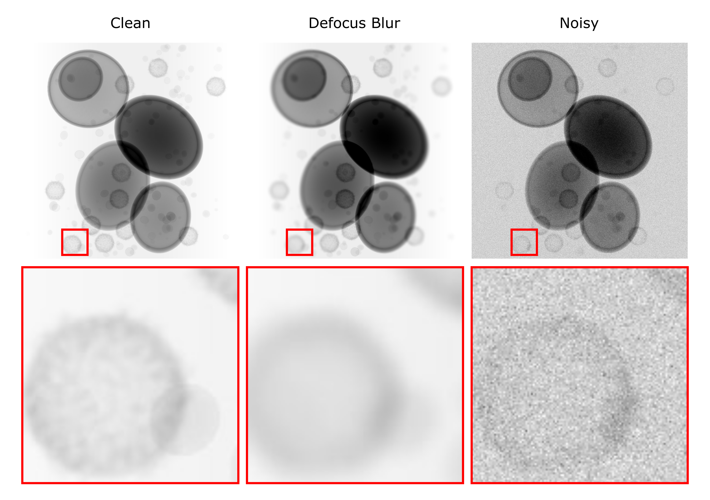

# ***"Clean Implicit 3D Structure from Noisy 2D STEM Images", CVPR 2022***  

This directory contains all code regarding the synthetic data generation.

---
## Generation of Phantom Volume
---

To generate a new phantom volume run the script 

    RandomCell.py

Args parameters for phantom generation. For details please see 

    RandomCell.py --help

|Args Parameter   | Explanation | Default |  
|---|---|---|
|--resolution| Resolution of phantom volume | 512 |
|--slice_thickness | sample thickness of phantom volume in voxels | 300 |
|--max_num_virus | maximum number of virus particles to be placed | 200 |
|--virus_path | path to density map of virus | ./VirusPDB/6mid_15A.mrc |
|--iterations | number of iterations to try placing objects | 1000 |
|--out | output directory | ./PhantomVolume/' |

## Generation of Projections
---
Generate Projections with and without noise. Therefore please use the STEMImageFormation.ipynb

For adaptions to create defocus blur and/or noisy data please adapt according cells in the jupyter notebook.

